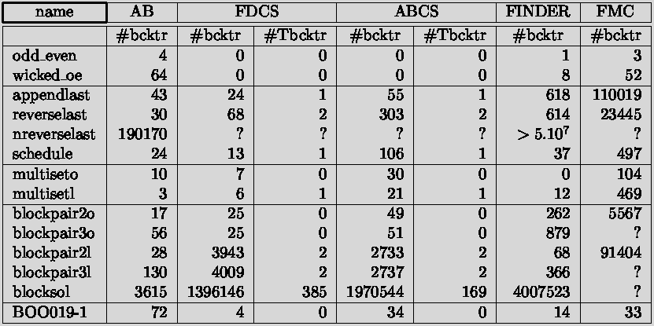

# Progression

## + Positives

- So far structure recognition module is able to recognize basic structures of both types of tables

- So far there is no differentiation between table and text around it - that would be probably the last part, but even in such case table is recognized correctly

## - Negatives

- Some incorrectly recognized tables:
    - due to wrong order of operations (changing order would result in same errors in different cases)

     
    

    - due to not precise enough parameters
    
     
    

